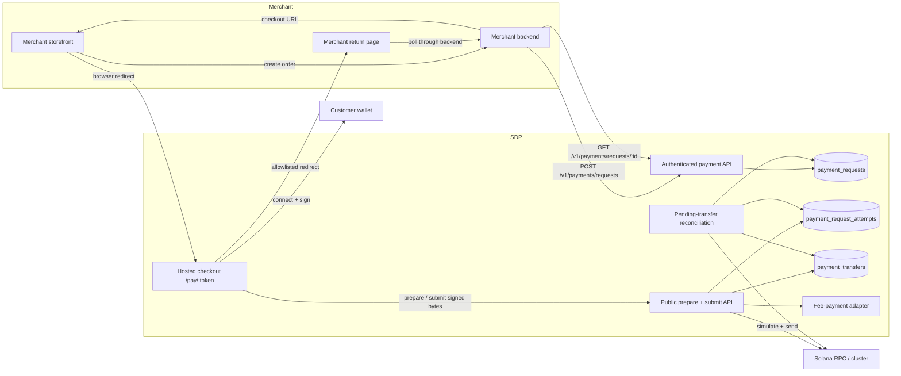
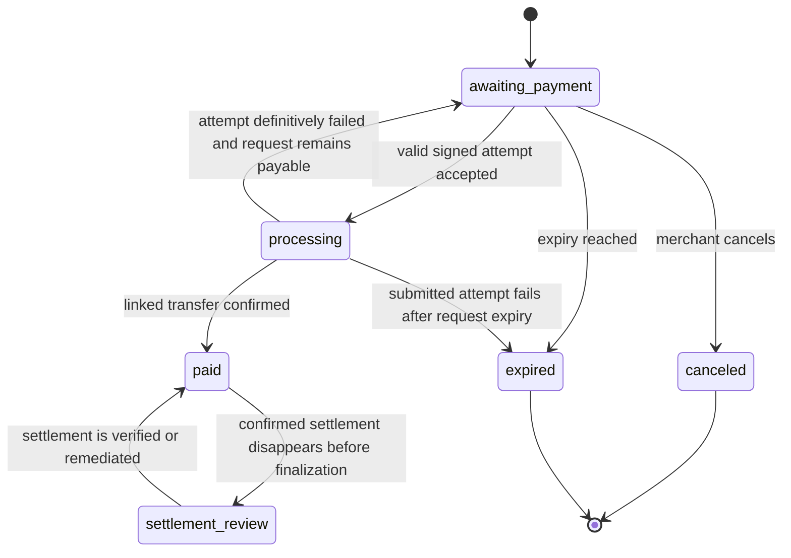
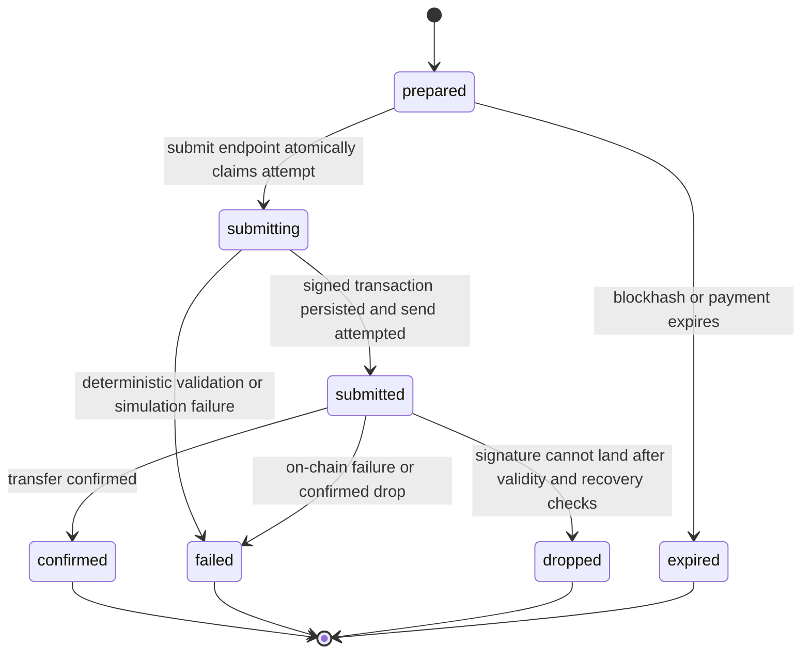

# Merchant Pay — hosted checkout architecture

## Purpose

Merchant Pay lets a merchant create a fixed-amount Solana payment through the
SDP API, redirect the customer to an SDP-hosted checkout, receive a
wallet-signed transaction back at SDP, and poll SDP until the payment reaches
Solana `confirmed` commitment.

The design extends the existing Payment Request product. It does not introduce
a parallel merchant-payment ledger or change the existing outbound payment
flow.

## Product decisions

- Checkout is hosted by SDP.
- The payer uses an externally controlled browser or mobile wallet.
- The wallet signs but does not submit the transaction.
- SDP validates the payer-signed message, adds the sponsor signature only at
  submission time, simulates, and submits the fully signed transaction.
- Funds settle into an existing SDP custody wallet owned by the merchant
  project.
- SOL and SDP-supported SPL tokens are supported.
- SDP sponsors network fees through the existing fee-payment adapter.
- A merchant may treat the payment as successful at Solana `confirmed`
  commitment. The linked transfer may advance to `finalized` later.
- Version one uses authenticated merchant polling, not outbound settlement
  webhooks.
- The browser returns to an allowlisted merchant URL with the internal SDP
  payment ID and a non-authoritative status.
- SDP stores payment facts, a merchant order ID, and bounded opaque metadata.
  Line items, customer records, and fulfillment state remain merchant-owned.

## Existing SDP capabilities reused

| Capability | Existing source | Merchant Pay use |
|---|---|---|
| Payment identity and token pattern | `payment_requests` and `PaymentRequestsRepository` | Durable merchant payment; hosted mode adds a hashed request-scoped checkout credential |
| Hosted public page | `apps/sdp-web/src/app/pay/[token]` | Wallet connection, review, signing, submission, and redirect |
| SOL/SPL transaction construction | `apps/sdp-api/src/routes/pay.ts` and `routes/payments/token-accounts.ts` | Exact fixed-amount transfer to the merchant custody wallet |
| Fee sponsorship | `createProjectSponsorshipFeePayment` and `FeePaymentPort` | Resolve the fee payer during prepare; add its signature only after SDP accepts submit |
| Solana RPC | `@sdp/rpc/solana` | Blockhash, simulation, submission, and signature status |
| Transfer ledger | `payment_transfers` | On-chain attempt state, serialized transaction, signature, slot, and error |
| Pending transfer reconciliation | `trackPendingTransfers` | Advance submitted transfers to confirmed, finalized, or failed |
| Legacy Solana Pay reconciliation | `findReference` and `validateTransfer` | Preserve current QR/deep-link settlement as a compatibility path |
| Authentication and tenancy | unified auth, project context, permissions | Merchant create/read/cancel APIs |
| API-key wallet scope | `assertApiKeyWalletAccess` | Ensure the destination custody wallet belongs to the caller's scope |
| Idempotency conventions | idempotency middleware and transfer fingerprinting | Safe merchant retries when creating a payment |

The existing hosted page currently displays a Solana Pay QR/deep link. It does
not connect a wallet or call `signTransaction`. The implementation therefore
needs a Wallet Standard-compatible client integration in `sdp-web`; no wallet
adapter dependency is currently present.

Hosted checkout and legacy Solana Pay are explicit modes:

- `hosted`: the transaction is valid only through an SDP attempt. The legacy
  `/pay/:token/tx` endpoint and reference-discovery settlement are disabled.
- `solana_pay`: preserves today's fee-payer-signed transaction-request and
  reference-discovery behavior.

This separation prevents a hosted payer from obtaining a sponsor-signed
transaction through the legacy endpoint and broadcasting it without SDP's
validation.

## System context



## Source-of-truth boundaries

### Payment Request

`payment_requests` is the business object exposed to the merchant. It answers:

- What amount and token must be paid?
- Which merchant custody wallet receives the funds?
- Which merchant order does the payment correlate to?
- Is the payment still payable, currently processing, paid, canceled, or
  expired?
- Which transfer fulfilled it?

### Payment Request Attempt

`payment_request_attempts` is a prepared-transaction session. It answers:

- Which payer wallet requested the transaction?
- Which exact transaction message did SDP issue?
- When does its blockhash expire?
- Did the browser return a valid payer signature?
- Which transaction signature was submitted?
- Which transfer row tracks the on-chain result?
- Why did this attempt fail?

A payment can have multiple attempts over time because a customer may reject
signing, a blockhash may expire, or a submitted transaction may definitively
fail. Only one live attempt is permitted. Prepare replays a still-valid attempt
for the same payer and rejects a different payer until the attempt can no
longer land. An attempt is not a merchant order and is never used as the
merchant's primary identifier.

### Payment Transfer

`payment_transfers` remains the chain ledger. It stores the signed wire
transaction, transaction signature, processing/confirmed/finalized/failed
state, slot, and RPC error. Merchant Pay creates an inbound transfer because
funds move from the customer's wallet into the merchant's SDP wallet.

## State models

### Payment state



`canceled` and `expired` are terminal. `paid` is successful for merchant
fulfillment but continues to be monitored until the transfer finalizes. A rare
confirmed-chain rollback moves the request to `settlement_review` and raises an
operator alert; it never silently regresses to payable. A processing payment
does not expire merely because wall-clock expiry passes while its transaction
is in flight. If that attempt subsequently fails, the payment becomes
`expired` instead of returning to `awaiting_payment`.

### Attempt state



An RPC timeout after broadcast is not a deterministic failure. SDP retains the
attempt as `submitted` and reconciles its known signature.

### Transfer state

Merchant Pay reuses the existing transfer progression:

```text
processing -> confirmed -> finalized
processing -> failed
```

The Payment Request becomes `paid` at `confirmed`; finalization is visible on
the linked transfer.

## End-to-end control flow

```mermaid
sequenceDiagram
    autonumber
    actor Customer
    participant Store as Merchant storefront
    participant Merchant as Merchant backend
    participant API as SDP authenticated API
    participant Checkout as SDP hosted checkout
    participant Wallet as Customer wallet
    participant Sponsor as Fee-payment adapter
    participant DB as Postgres
    participant RPC as Solana RPC
    participant Job as Reconciliation job

    Customer->>Store: Click "Solana Pay"
    Store->>Merchant: Start checkout for merchant order
    Merchant->>API: POST /v1/payments/requests + Idempotency-Key
    API->>DB: Insert or replay Payment Request
    API-->>Merchant: paymentId, status, checkoutUrl
    Merchant->>Store: Redirect to checkoutUrl
    Store->>Checkout: GET /pay/:checkoutToken
    Checkout->>API: GET public checkout state
    API-->>Checkout: amount, token, recipient, expiry, state
    Customer->>Checkout: Connect wallet and approve
    Checkout->>API: POST /pay/:token/attempts {account}
    API->>DB: Verify request is payable
    API->>Sponsor: Resolve fee-payer address
    Sponsor-->>API: Fee-payer address
    API->>DB: Persist attempt, canonical message, blockhash, expiry
    API-->>Checkout: attemptId, transaction, lastValidBlockHeight
    Checkout->>Wallet: signTransaction(transaction)
    Wallet-->>Checkout: Payer-signed transaction
    Checkout->>API: POST /pay/:token/attempts/:attemptId/submit
    API->>API: Compare exact message; verify payer signature and semantics
    API->>DB: Claim attempt as submitting; persist payer-signed bytes
    API->>Sponsor: Add fee-payer signature without sending
    Sponsor-->>API: Fully signed transaction
    API->>API: Verify sponsor output preserves message and payer signature
    API->>RPC: Strict signature-verified simulation
    RPC-->>API: Simulation success
    API->>DB: Persist processing transfer + deterministic signature
    API->>Sponsor: Submit fully signed transaction through fee-payment port
    Sponsor->>RPC: sendTransaction
    RPC-->>API: Accepted signature or ambiguous transport result
    API->>DB: Mark submitted and retain known signature
    API-->>Checkout: processing + allowlisted returnUrl
    Checkout->>Store: Redirect with sdp_payment_id and processing
    Store->>Merchant: Poll payment through merchant backend
    Merchant->>API: GET /v1/payments/requests/:paymentId
    API-->>Merchant: processing
    Job->>RPC: getSignatureStatuses(signature)
    RPC-->>Job: confirmed + slot
    Job->>DB: Atomically set transfer confirmed, attempt confirmed, request paid
    Merchant->>API: GET /v1/payments/requests/:paymentId
    API-->>Merchant: paid + linked transfer summary
    Merchant-->>Store: Fulfill order
```

## API design

All `/v1` operations use existing SDP authentication, project context,
permissions, and API-key wallet scoping. Hosted public operations use a
separate high-entropy, request-scoped checkout token whose hash is stored at
rest. The token expires with the payment and can be rotated without changing
the internal Payment Request ID. Legacy `solana_pay` requests retain their
existing public-token behavior. Public APIs never reveal merchant metadata or
the return URL before an accepted submit.

To preserve true idempotent create responses without storing raw bearer
credentials, a checkout-token service derives the secret from
`payment_request_id + token_version` using a dedicated server-held HMAC key.
The database stores only `token_version` and the derived token hash. SDP can
reproduce the same checkout URL for an authenticated idempotent replay;
rotation increments the version and invalidates the prior token.

### Create payment

`POST /v1/payments/requests`

Required headers:

```http
Authorization: Bearer <project API key>
Idempotency-Key: <merchant-generated retry key>
```

Request:

```json
{
  "walletId": "wallet_merchant",
  "token": "So11111111111111111111111111111111111111112",
  "amount": "1.25",
  "merchantOrderId": "order_8742",
  "returnUrl": "https://merchant.example/checkout/complete",
  "checkoutMode": "hosted",
  "expiresAt": "2026-08-10T13:00:00.000Z",
  "metadata": {
    "cartVersion": "3"
  }
}
```

Response:

```json
{
  "data": {
    "paymentRequest": {
      "id": "preq_...",
      "merchantOrderId": "order_8742",
      "walletId": "wallet_merchant",
      "token": "So11111111111111111111111111111111111111112",
      "amount": "1.25",
      "status": "awaiting_payment",
      "expiresAt": "2026-08-10T13:00:00.000Z",
      "checkoutUrl": "https://dashboard.sdp.example/pay/<checkoutToken>",
      "createdAt": "...",
      "updatedAt": "..."
    }
  }
}
```

Creation rules:

- `walletId` must resolve to an accessible custody wallet in the project.
- `token` must be SOL or appear in the project's
  `merchantPayAllowedMints` list for its configured cluster. Supported token
  programs and extensions are validated explicitly.
- `amount` must be positive and exactly representable at the token's decimals.
- `merchantOrderId` is required, bounded, and unique within the project.
- `metadata` must be a bounded JSON object with limits on encoded bytes, depth,
  key count, key length, and value length. It is not rendered by checkout, and
  the public contract forbids secrets or unnecessary personal data.
- `returnUrl` must be HTTPS and have an exact origin match in the project's
  Merchant Pay return-origin allowlist. Sandbox may explicitly allow localhost.
- Sponsored fee/rent reservations must fit the project's canonical integer
  `merchantPayDailySponsorshipLamports` quota before the signer is invoked.
- New hosted create/prepare requires both the deployment-owned
  `MERCHANT_PAY_ENABLED` switch and project-admin-owned
  `merchantPayEnabled` setting. Both default off; disabling either never
  blocks reads, submission of an already prepared attempt, or reconciliation.
- `expiresAt` must be in the future and within the configured maximum lifetime.
- The idempotency fingerprint includes every behavior-affecting request field.
  Reusing a key with a different fingerprint returns `409`.

### Poll payment

`GET /v1/payments/requests/{paymentRequestId}`

The project-scoped response includes the payment, latest attempt summary, and
linked transfer summary. It must not require list scanning.

```json
{
  "data": {
    "paymentRequest": {
      "id": "preq_...",
      "merchantOrderId": "order_8742",
      "status": "processing",
      "amount": "1.25",
      "token": "So11111111111111111111111111111111111111112",
      "expiresAt": "...",
      "latestAttempt": {
        "status": "submitted",
        "signature": "5..."
      },
      "transfer": {
        "id": "xfr_...",
        "status": "processing",
        "signature": "5..."
      },
      "createdAt": "...",
      "updatedAt": "..."
    }
  }
}
```

Merchant fulfillment must depend on an authenticated response with
`paymentRequest.status === "paid"`. The browser callback is advisory.
Processing responses include `Retry-After`, attempt timestamps, and stable
machine-readable error codes without returning serialized transaction data.

### Cancel payment

`POST /v1/payments/requests/{paymentRequestId}/cancel`

Cancellation succeeds only while the request is `awaiting_payment` and no
attempt is being submitted. It is idempotent. A `processing` or `paid` request
cannot be canceled because a signed transaction may already be in flight.

### Read public checkout

`GET /pay/{checkoutToken}`

Returns only:

- display amount and token label;
- merchant recipient address;
- cluster;
- expiry;
- public checkout state;
- whether a new attempt may be prepared.

It does not return `merchantOrderId`, metadata, internal IDs, API credentials,
or return URL.

### Prepare attempt

`POST /pay/{checkoutToken}/attempts`

Request:

```json
{
  "account": "<payer Solana address>"
}
```

Response:

```json
{
  "attemptId": "patt_...",
  "transaction": "<base64 transaction requiring payer and sponsor signatures>",
  "message": "Pay 1.25 SOL",
  "lastValidBlockHeight": "...",
  "expiresAt": "..."
}
```

Preparation:

1. Reconcile any already-submitted hosted attempt.
2. Reject paid, canceled, expired, or currently submitting payments.
3. Validate the payer address.
4. Generate the attempt ID.
5. Resolve the fee-payer public address through an address-only adapter method
   that cannot load or construct a signing-capable key.
6. Resolve a recent blockhash.
7. Build the SOL or SPL transfer to the persisted destination and append the
   persisted Solana Pay reference account.
8. Persist canonical message bytes and hash, unsigned transaction template,
   payer, fee payer, blockhash, last valid block height, and attempt expiry.
9. Return the transaction to the browser.

Prepare creates no policy operation. Submit creates or replays the policy
operation using the now-persisted attempt ID as its idempotency key, avoiding
concurrent candidate-attempt policy races.

If a live attempt already exists for the same payer, prepare replays it. If a
live attempt belongs to a different payer, prepare returns `409`. A new attempt
is created only after the prior attempt has definitively expired or failed.

The existing `POST /pay/:token/tx` transaction-request route remains only for
`solana_pay` mode. It rejects hosted requests.

### Submit attempt

`POST /pay/{checkoutToken}/attempts/{attemptId}/submit`

Request:

```json
{
  "transaction": "<base64 payer-signed transaction>"
}
```

Success response:

```json
{
  "paymentId": "preq_...",
  "status": "processing",
  "signature": "5...",
  "returnUrl": "https://merchant.example/checkout/complete?sdp_payment_id=preq_...&sdp_payment_status=processing"
}
```

`returnUrl` is produced by the server from the persisted, already-validated
URL. The browser must not supply it at submission time.

## Signed-transaction validation

Validation is fail-closed and occurs before broadcast.

1. Enforce request size and strict base64 decoding.
2. Decode exactly one supported versioned Solana transaction.
3. Reject address lookup tables unless the issued template used them. The
   initial implementation should issue no lookup tables.
4. Re-encode the message and compare its SHA-256 digest in constant time with
   the attempt's persisted message digest.
5. Verify the fee payer is signer index `0`, the expected payer occupies the
   issued signer slot, and its signature is valid for the message.
6. Verify the issued fee-payer signature slot remains empty before SDP
   sponsorship.
7. Reject missing payer, additional, or unexpected signatures and signer slots.
8. Verify the fee payer, payer, recent blockhash, and transaction version.
9. Verify instruction programs and semantics as defense in depth:
   - SOL: one System Program transfer of the persisted amount from payer to
     destination, with the persisted reference account.
   - SPL: optional idempotent destination ATA creation followed by one checked
     token transfer for the persisted mint, amount, authority, destination, and
     token program, with the persisted reference account.
10. Reject extra value-moving, compute-budget, memo, or arbitrary program
    instructions unless explicitly added to the issued template in a future
    version.
11. Require each SPL mint in the project's cluster-specific Merchant Pay mint
    allowlist. For Token-2022, initially allow no mint extensions and only
    `immutableOwner` on token accounts; reject unsupported transfer-fee, transfer-hook,
    confidential-transfer, frozen/default-state, permanent-delegate, or other
    extensions that can alter amount-received or execution semantics.
12. Confirm the blockhash remains valid and the payment/attempt remain payable.
13. Enforce the payment-request policy and sponsorship authorization before
    calling any signing method.
14. Atomically claim the attempt, then add the fee-payer signature through the
    existing sponsorship boundary.
15. Decode the sponsor result and re-verify the exact message, payer signature,
    fee-payer address, and newly added fee-payer signature.
16. Simulate the fully signed transaction through SDP's configured RPC with
    signature verification enabled.
17. Apply bounded compute, fee, ATA-rent, and transaction-size policies before
    send.

Exact message comparison is the primary mutation defense. Semantic validation
is retained so a storage or template-generation defect cannot silently turn
the public submit endpoint into an arbitrary sponsored transaction relay.

The existing RPC simulation helper currently uses `sigVerify: false`; hosted
submission requires either a strict option on that helper or an equivalent
strict simulation call after local cryptographic verification.

## Atomic submission and race handling

Sponsor signing and transaction broadcast cannot be part of a database
transaction. The submit path therefore uses a claimed-state-machine sequence:

1. Decode the payer-signed bytes, compare the exact message, and verify the
   payer signature and transaction semantics without mutating state.
2. Create or replay the attempt-keyed policy decision, refresh it if policy changed, and
   enforce sponsorship authorization before creating or invoking a signer.
   This ordering must be registered in
   `security/value-moving-conformance.node.test.ts` together with claimed-state
   replay evidence and the new signing sink.
3. In one database transaction, atomically claim the prepared attempt as
   `submitting` and persist the payer-signed bytes only if:
   - it belongs to the checkout token;
   - it is still `prepared`;
   - the payment is payable;
   - no other attempt is active.
4. Ask the fee-payment adapter to add its signature without sending.
5. Revalidate the adapter output, then strictly simulate the fully signed
   transaction.
6. Assert the sponsor signature occupies signer index `0`, then derive the
   deterministic Solana signature from the fully signed bytes.
7. In one database transaction:
   - create the inbound `payment_transfers` row as `processing`;
   - persist the full signed wire transaction and deterministic signature;
   - link transfer and attempt;
   - set payment state to `processing`.
8. Submit the already-fully-signed bytes through the fee-payment port using
   the same project-selected, cluster-verified RPC client used for simulation.
   `FeePaymentPort` should gain a submit-only operation so merchant checkout
   preserves the repository's single gasless submission boundary without
   signing the message a second time.
9. If RPC accepts or reports an already-known transaction, mark the attempt
   `submitted`.
10. If RPC returns a timeout or another ambiguous transport error, retain
   `submitted`/`processing`; reconciliation checks the known signature.
11. Only a deterministic pre-broadcast rejection may mark the attempt `failed`
   immediately and return the payment to `awaiting_payment`.

This ordering prevents duplicate sends, duplicate transfer rows, and the
unrecoverable case where Solana accepted a transaction but SDP lost its
signature.

Concurrent submit requests are handled by compare-and-set state transitions
and unique constraints. Replaying the same valid bytes returns the current
attempt/payment state rather than broadcasting again. Different bytes for a
claimed attempt return `409`.

A crash after claim but before sponsor signing is recovered from the persisted
payer-signed bytes. A crash after sponsor signing but before transfer creation
repeats deterministic signing of the same message, revalidates it, and
continues. A crash after transfer creation is reconciled by the persisted
deterministic signature and immutable fully signed bytes.

## Reconciliation

The existing `trackPendingTransfers` job already batches
`getSignatureStatuses` for processing transfers. Merchant Pay extends its
settlement handling and continues monitoring confirmed Merchant Pay transfers
until finalization:

- `confirmed`: atomically update transfer to `confirmed`, attempt to
  `confirmed`, and Payment Request to `paid` with `fulfilled_by_transfer_id`.
- `finalized`: update the transfer to `finalized`; Payment Request remains
  `paid`.
- on-chain error: update transfer and attempt to `failed`; return Payment
  Request to `awaiting_payment` if it has not expired, otherwise `expired`.
- signature not found while the blockhash remains valid: rebroadcast the exact
  persisted fully signed bytes; accepted, already-known, and ambiguous results
  remain `processing`.
- signature not found after blockhash invalidity is proven and historical
  signature lookup through configured RPC failover is also absent: apply the
  failure/retry rule. A deterministic rebroadcast rejection alone is
  insufficient evidence to drop the attempt.
- a previously confirmed, not-yet-finalized signature that disappears or
  becomes invalid: move the Payment Request to `settlement_review`, preserve
  its audit history, and alert operators. Never silently make it payable again.

Authenticated `GET /v1/payments/requests/:id` may perform a targeted
best-effort status refresh for the active known signature to reduce visible
poll latency. Correctness must not depend on reads; the background job remains
authoritative.

Attempt recovery extends the cron infrastructure with bounded pagination,
fair project scheduling, RPC failover/backoff, and guarded claims so concurrent
workers cannot settle the same attempt twice. Unrecoverable invariant failures
enter `settlement_review` for manual handling rather than being retried
forever. Stuck `submitting`, `processing`, and pre-finalization states have
separate age alerts.

Legacy `solana_pay` Payment Requests continue to use `findReference` plus
`validateTransfer`. Hosted requests never use chain discovery; they settle only
through their known attempt signature and transfer record.

## Browser checkout behavior

The public checkout page uses the existing quiet SDP payment card grammar:

1. Load payment summary.
2. Show terminal paid/canceled/expired states without wallet controls.
3. Offer compatible wallets that support transaction signing.
4. Connect the selected wallet.
5. Prepare or replay the one live attempt for that wallet address.
6. Show amount, token, destination, network, and fee sponsorship before
   approval.
7. Call wallet `signTransaction`; never call wallet `sendTransaction`.
8. Submit returned bytes to SDP.
9. On deterministic rejection, keep the customer on checkout with a safe retry
   action.
10. On accepted or ambiguously broadcast submission, redirect to the persisted
    merchant return URL with:

```text
sdp_payment_id=<internal Payment Request ID>
sdp_payment_status=processing
```

The callback contains no checkout token, API key, metadata, wallet signature, or
customer data. Existing merchant query parameters are preserved unless they
conflict with SDP-reserved names.

The return page should call the merchant backend. The merchant backend polls
SDP with its API key and returns a loading, success, expiration, or retry state
to the storefront.

## Persistence changes

The detailed migration should follow existing Postgres repository patterns.
Conceptually:

### Extend `payment_requests`

- `checkout_mode TEXT` (`hosted` or `solana_pay`)
- `merchant_order_id TEXT`
- `metadata JSONB NOT NULL DEFAULT '{}'`
- `return_url TEXT`
- `checkout_token_hash TEXT`
- `checkout_token_version INTEGER`
- `idempotency_key TEXT`
- `request_fingerprint TEXT`
- permit `processing` and `settlement_review` in the status constraint

Recommended constraints:

- unique `(organization_id, project_id, merchant_order_id)` where merchant
  order ID is present;
- unique `(organization_id, project_id, idempotency_key)` where idempotency key
  is present;
- metadata must be a JSON object;
- paid still requires `fulfilled_by_transfer_id`;
- terminal states cannot regress.

Existing Payment Requests remain valid with null merchant-specific fields.

### Add `payment_request_attempts`

Core fields:

- `id`
- `payment_request_id`
- `organization_id`
- `project_id`
- `payer_address`
- `status`
- `transaction_version`
- `message_hash`
- `unsigned_tx`
- `payer_signed_tx`
- `signed_tx`
- `fee_payer_signature`
- `transaction_signature`
- `blockhash`
- `last_valid_block_height`
- `expires_at`
- `transfer_id`
- `error_code`
- `error`
- `created_at`
- `updated_at`
- `submitted_at`
- `confirmed_at`

Constraints and indexes:

- tenant-consistent foreign keys to Payment Request and transfer;
- unique transaction signature when present;
- one live `prepared`, `submitting`, or `submitted` attempt per Payment Request;
- list/index by Payment Request and newest creation time;
- list/index submitted attempts for recovery;
- immutable payer, message hash, blockhash, and issued transaction after
  creation.

Large serialized transaction fields must not be logged.

## Security controls

### Checkout token

- Use a separate high-entropy request-scoped token for hosted checkout and
  store only its hash.
- Derive/reproduce it through a dedicated HMAC-backed token service so
  authenticated idempotent create replay can return the same checkout URL.
- Treat possession as authorization only for payer-safe checkout operations.
- Expire it with the payment and support rotation.
- Never include it in merchant callbacks or logs.
- Add token-scoped and IP-aware rate limits to reads, prepares, and submits.

### Sponsorship abuse

- A checkout token can only sponsor the exact merchant-authored amount, token,
  recipient, and reference.
- Enforce per-project sponsorship quotas and per-payment attempt limits.
- Cache or persist preparation rate limits so repeated blockhash preparation
  cannot exhaust Kora quota.
- Expire unused attempts promptly.

### Return redirects

- Configure allowed origins at project scope through an authenticated setting.
- Require exact scheme, host, and effective port match.
- Require HTTPS outside explicitly permitted sandbox localhost origins.
- Resolve and append callback parameters server-side.
- Reject userinfo, malformed ports, non-HTTP schemes, and origin confusion.

### Browser and API

- Use a restrictive Content Security Policy on checkout.
- Do not render opaque metadata.
- Protect against clickjacking unless approved embedding origins are configured.
- Use explicit CORS rules for public submit endpoints.
- Apply body-size limits before JSON/base64 parsing.
- Return safe error codes to the payer and keep provider/RPC details in
  structured internal logs.
- Never log signed transactions, signatures as bearer credentials, API keys,
  or full public checkout URLs.

### Transaction

- Exact-message hash comparison and local signature verification are mandatory.
- The sponsor signature is withheld during prepare, so payer-signed bytes
  cannot be broadcast without returning through SDP submit.
- No arbitrary transaction relay endpoint is introduced.
- Reject message mutation even when the resulting transfer would still pay the
  merchant.
- Validate cluster consistency so a sandbox transaction cannot be submitted to
  production or vice versa.

## Error semantics

| Condition | Public behavior | Merchant-visible state |
|---|---|---|
| Unknown checkout token | `404` | None |
| Paid, canceled, or expired request | `409` or non-payable checkout state | Terminal current state |
| Blockhash/attempt expired before submit | `409 ATTEMPT_EXPIRED`, prepare again | `awaiting_payment` unless payment expired |
| Wallet omitted or changed required signature | `400 INVALID_SIGNATURE` | No payment transition |
| Message differs from issued template | `400 TRANSACTION_MISMATCH` | No payment transition; security event |
| Simulation deterministic failure | `422 TRANSACTION_SIMULATION_FAILED` | Attempt failed; payment remains payable when eligible |
| Concurrent attempt won submission | `409 PAYMENT_ALREADY_PROCESSING` | `processing` |
| RPC accepted send | `202` | `processing` |
| RPC result ambiguous | `202` with reconciliation message | `processing` |
| On-chain confirmed error | Poll returns payable or expired state plus safe last-attempt error | Retry if still payable |
| Confirmed | Poll returns `paid` | Merchant may fulfill |
| Confirmed settlement rolls back before finalization | Poll returns `settlement_review`; operator alert fires | Merchant follows exception process |

Error responses use SDP's existing structured error envelope and stable machine
codes. Raw RPC logs are not exposed publicly.

## Observability and operations

Metrics:

- payment requests created by project, token, and cluster;
- prepare and submit counts;
- wallet-sign rejection/abandonment inferred from expired prepared attempts;
- validation failures by stable reason;
- simulation failures;
- RPC accepted, ambiguous, and deterministic failures;
- time from create to prepare, submit, confirmed, and finalized;
- processing-age distribution;
- reconciliation lag and dropped-signature recovery;
- sponsorship spend and quota rejection;
- payment conversion and expiry rate.

Structured logs correlate:

- `payment_request_id`
- `attempt_id`
- `transfer_id`
- transaction signature
- organization/project IDs
- stable error code

Do not log the checkout token, return URL query string, metadata, or serialized
transaction.

Alerts:

- sustained reconciliation failures;
- processing attempts older than the recovery threshold;
- elevated transaction-mismatch or invalid-signature rates;
- sponsorship quota or fee-payer balance exhaustion;
- confirmed transfers whose Payment Request did not become paid;
- paid requests missing a fulfilled transfer.

## Testing strategy

### Unit tests

- payment and attempt transition guards;
- request fingerprint and idempotent replay;
- return-origin validation and callback construction;
- metadata and merchant order ID limits;
- SOL and SPL issued-message construction;
- exact message hash comparison;
- payer signature verification before sponsorship;
- fee-payer signature absence before sponsorship and validity after sponsorship;
- altered recipient, amount, mint, reference, blockhash, fee payer, and
  instruction rejection;
- blockhash and payment expiry behavior;
- error classification into deterministic versus ambiguous send outcomes.

### Repository tests

- create/read/cancel Payment Request by tenant;
- merchant order and idempotency uniqueness;
- immutable attempt fields;
- one live attempt per payment;
- atomic transfer/attempt/payment linking;
- compare-and-set replay behavior;
- confirmed settlement and failed-attempt retry transitions.

### API integration tests

- authenticated idempotent create and get-by-ID;
- API-key wallet-scope enforcement;
- public summary privacy;
- prepare for SOL and SPL;
- submit a valid payer-signed transaction and add the sponsor signature;
- reject missing/invalid payer signatures, unexpected pre-added sponsor
  signatures, mutated messages, oversized or malformed bytes, wrong tokens,
  wrong clusters, and expired transactions;
- duplicate and concurrent submit;
- two-payer prepare contention and live-attempt replay;
- rejection of hosted requests at legacy `/pay/:token/tx`;
- deterministic simulation failure;
- ambiguous RPC send followed by successful reconciliation;
- confirmed, finalized, failed, canceled, and expired polling responses;
- legacy `/pay/:token/tx` compatibility.

### Web end-to-end tests

- connect a compatible mocked wallet;
- approve and return a signed transaction without wallet-side send;
- display safe validation errors and retry;
- redirect only to an allowlisted origin;
- merchant return page polls through its backend;
- paid/canceled/expired terminal checkout states;
- mobile viewport and wallet capability filtering.

### Security and conformance tests

- include public submit routes in value-moving conformance coverage;
- prove policy enforcement occurs before `signAsFeePayer` and register the
  signing sink plus claimed-state replay evidence;
- property/fuzz tests for transaction decoding and message mutation;
- adversarial Token-2022 extension and amount-received tests;
- rate-limit and sponsorship-quota tests;
- CSP, framing, and open-redirect tests;
- verify no serialized transaction or checkout token reaches logs.

## Rollout

1. Add schema, repository, types, and authenticated create/get/cancel API while
   preserving existing request rows.
2. Add attempt preparation and validation behind a project feature flag.
3. Add hosted wallet signing UI in sandbox.
4. Extend reconciliation and prove crash/timeout recovery.
5. Publish OpenAPI, generated API reference, merchant integration guide, and
   polling example.
6. Enable selected sandbox projects with sponsorship limits and monitoring.
7. Run end-to-end devnet payments for SOL and SPL, including failure injection.
8. Enable production projects gradually.
9. Keep the existing Solana Pay transaction-request path available for
   `solana_pay` mode throughout rollout.

Rollback disables new attempt creation while retaining reads and
reconciliation for already-submitted attempts. Never disable reconciliation
for in-flight payments.

## Non-goals for version one

- Merchant settlement webhooks.
- Refunds, partial capture, tips, split settlement, or partial payments.
- Fiat conversion or ramp orchestration.
- Storing line items, customer profiles, shipping data, or merchant
  fulfillment state.
- Arbitrary merchant-provided destination addresses.
- Merchant-provided unsigned transactions or arbitrary instruction execution.
- Multi-chain checkout.
- Treating browser callback parameters as proof of payment.

## Acceptance criteria

- A merchant can idempotently create a fixed-amount payment into an accessible
  SDP custody wallet and receive an internal payment ID plus hosted checkout
  URL.
- A customer can connect a compatible wallet on the hosted page and sign a
  sponsored SOL or supported SPL transaction.
- The browser returns the signed transaction to SDP without submitting it.
- SDP accepts only the exact issued transaction with valid required signatures,
  simulates it, persists recoverable state, and submits it to the configured
  Solana RPC.
- Duplicate or ambiguous submissions cannot create duplicate payments or lose
  the transaction signature.
- Reconciliation marks the Payment Request paid at `confirmed` and continues
  transfer tracking to `finalized`, with `settlement_review` for an exceptional
  pre-finalization rollback.
- The checkout redirects only to an allowlisted return origin and includes only
  the internal payment ID and advisory processing status.
- The merchant can poll one authenticated get-by-ID endpoint and safely fulfill
  only after it returns `paid`.
- Existing `solana_pay` Payment Requests continue to work, while hosted
  requests cannot access the legacy sponsor-signed transaction route.
